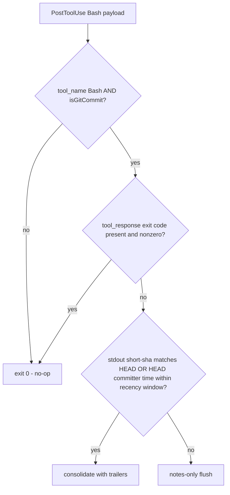
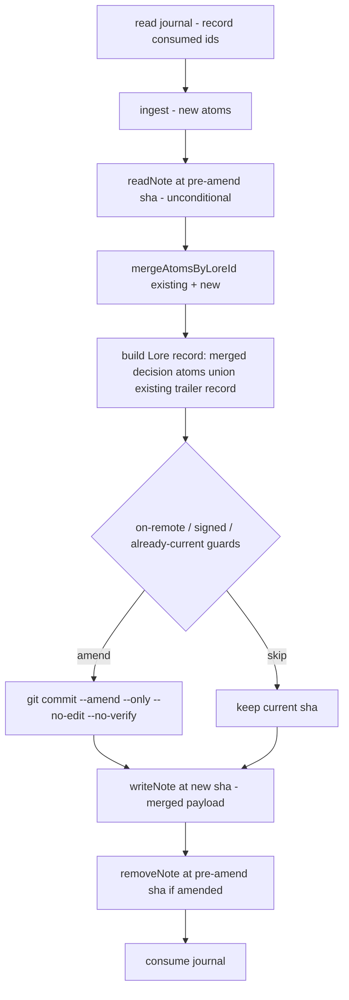
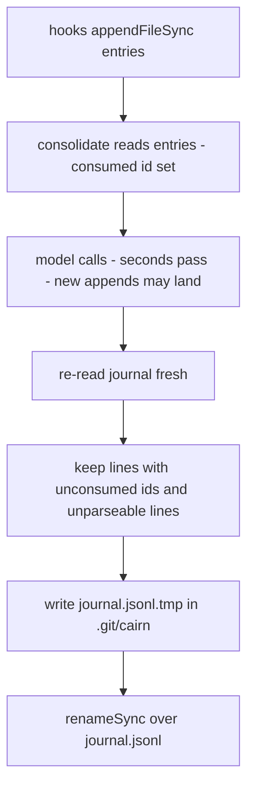

# fix: Close the 2026-06-12 review findings — write-path safety, enforcement, read-path correctness

## Summary

Fix every finding from the 2026-06-12 codebase review in blast-radius order: the critical re-consolidation data loss, the two amend-path hazards, the journal durability race, the enforcement and test-coverage gaps, the moderate read-path and trailer-handling defects, and a single documentation pass. The note cache and pure-cosmetic items are deferred to follow-up.

---

## Problem Frame

The review (origin doc) verified that Cairn delivers 27 of 30 claims and that its architecture holds — but found one critical bug and three major hazards on the only path where Cairn rewrites user history, plus untested high-blast-radius guards and a bypassable decoupling test. Until these land, a re-consolidation can silently destroy recorded decisions, an amend can fold a user's staged work into the wrong commit, and the "a missed trigger loses nothing" durability invariant has a real loss window.

Flow analysis of the four write-path fixes established a safe landing order (C2 → C1 → C3 → C4), surfaced a rollup-contamination hazard in the C1 merge, and showed C4 is only safe after the journal-id collision fix.

---

## Requirements

**Write-path safety**

- R1. An amend never changes a commit's tree: staged-but-uncommitted changes are not folded in, and the user's commit hooks do not re-run on the amend.
- R2. Re-consolidating at the same HEAD preserves every previously recorded decision in both the notes graph and the commit's trailer block (merge, never clobber).
- R3. A Bash trigger that did not actually create a new commit results in a notes-only flush, never a trailer amend of the previous commit.
- R4. Consolidation deletes only the journal entries it consumed; entries appended during consolidation survive.
- R5. Journal entry ids are unique per appended entry (no same-millisecond collisions).

**Enforcement**

- R6. The engine-decoupling check cannot be bypassed by multi-line imports, `./../` specifiers, or non-literal dynamic imports, and fails closed; the test and `scripts/verify.mjs` share one implementation.
- R7. "`child_process` appears only in `src/store/git.ts`" is enforced by a test.

**Read-path and trailer correctness**

- R8. Foreign trailers survive a Cairn re-amend intact, including folded continuation lines; every emitted trailer value is newline-safe.
- R9. `why(file)` under budget pressure drops oldest level-0 atoms first with no silent mid-chain gaps; `recent(n)` distinguishes "hit the requested n" from "trimmed for budget" in both the result flag and the rendered message.
- R10. Read-side graph assembly lives in a delivery-agnostic module consumed by both MCP and the dream; the stale/reverted annotation composition exists in exactly one place.
- R11. `why`/`recent` output marks served content as recorded notes, not instructions, and strips control characters.

**Coverage and edge behavior**

- R12. The amend guards (on-remote, signed, already-current) have direct test coverage.
- R13. The no-key fallback chain, supersedes linking, `extractJson` recovery, transcript extraction, CLI hook-payload gating, and journal torn-write resilience are tested.
- R14. Consolidating in a repo with no HEAD returns `{ok: false}` instead of throwing.

**Documentation**

- R15. README/DESIGN match the code: test count, config knobs (`STORE_TOKEN_BUDGET`, `DEFAULT_RECENT`), and MCP repo resolution (docs corrected to `process.cwd()` fallback; `roots/list` not implemented).
- R16. The stale `docs/verification/REPORT.md` carries a superseded banner; the notes-push instructions carry a privacy warning.

---

## Key Technical Decisions

- **C2 fix is `git commit --amend --only --no-edit --no-verify -F -`:** `--only` with no pathspec is git's documented message-only amend (verified against the local man page); `--no-verify` skips the user's hooks because the tree already passed them. The existing on-remote/signed/already-current guards are untouched.
- **C1 record is built from the merged set, filtered to decision atoms:** `readNote(pre-amend sha)` runs unconditionally; atoms merge via the existing `mergeAtomsByLoreId`; `buildLoreRecord` receives only `isDecisionAtom` members of the merged set (rollups in a note must not leak into `Constraint:` lines or make the Lore-id compaction-state-dependent). The final record also unions the parsed existing trailer record (`readCommitTrailers` is already called for the already-current check), making the trailer block monotone under crash-retry and under dream-pruned notes.
- **C1 ordering:** read → merge → build record → amend → `writeNote(new sha)` → `removeNote(old sha)`. `removeNote` is already `allowFail`; an orphaned old note is benign and gets cleaned by Lore-id dedupe (U7).
- **C3 is a composite gate evaluated in `cmdConsolidateIfCommit`, before any model call:** require `tool_response` exit success when present, AND (short-sha from the commit's stdout matches HEAD, OR HEAD's committer timestamp is within a small recency window). Anything else demotes to a notes-only flush. Current Claude Code fires `PostToolUse` only on exit 0, but compound commands (`git commit || true`, `cmd; echo done`) still exit 0, so the HEAD checks stay. All checks run against `repoRoot(payload.cwd)` — which also fixes the `cd subdir && git commit` cross-repo hazard. `PostToolUseFailure` is deliberately not wired: on a failed commit we want no consolidation; the journal already preserves everything for the next trigger.
- **C4 is consume-by-id with re-read and same-directory temp+rename:** record consumed ids at read time; at clear time re-read the journal fresh, keep lines whose id is not consumed (and keep unparseable lines — they are someone else's torn write), write `journal.jsonl.tmp` in `.git/cairn/`, `renameSync` over the original. Byte-prefix truncation is rejected (no race-free front-truncate). The residual sub-millisecond window is accepted and documented; locking would violate the never-block-the-session policy. The journal-id fix (R5) is a hard prerequisite — a colliding new entry would otherwise be filtered as already-consumed.
- **C5 uses the TypeScript compiler API in one shared `.mjs` helper:** `ts.createSourceFile` + walking import/export/`import()`/`require()` nodes (no `createProgram` needed); specifiers normalized via `path.posix.normalize` and rejected if they resolve outside `src/engine/`; non-literal dynamic-import specifiers fail closed. The helper lives in `scripts/lib/` as plain `.mjs` so `scripts/verify.mjs` (plain node) and `tests/decoupling.test.ts` (tsx) both import it. A negative self-test proves the checker catches wrapped imports and `./../` escapes.
- **M1 extraction creates `src/read/`:** the notes∪trailers assembly, Lore-id dedupe, and stale-then-reverted annotation composition move out of `src/mcp/graph.ts` into a module that imports engine + store (legal — only the engine is import-restricted). `src/mcp/` keeps `server.ts` + `format.ts` as a thin protocol adapter; `src/capture/dream.ts` consumes the same composition. The entries-through-dedupe shape and annotator semantics from the staleness/revert plans carry over intact; the existing staleness/revert test suites are the safety net.
- **Recall contract (M4/M5):** strict drop-oldest-first for level-0 atoms — once a level-0 atom does not fit, stop considering older level-0 atoms (`break` semantics); level-1 rollups remain exempt (cheap, cover old history — the case the current comment defends). `recent(n)` splits the n-cap from budget truncation (`limited` vs `truncated`) and `format.ts` renders each honestly.
- **`roots/list` resolves as a docs correction, not an implementation** (per scope confirmation): current Claude Code docs guarantee `CLAUDE_PROJECT_DIR` in the spawned server's environment, so the `process.cwd()` fallback is acceptable; README/DESIGN stop implying the fallback exists in Cairn.
- **Test infrastructure consolidates before the new git-heavy tests land:** one `tests/helpers/repo.ts` (five near-identical `makeRepo`/`gitC` copies exist today) with `GIT_CONFIG_GLOBAL=/dev/null` + `GIT_CONFIG_SYSTEM=/dev/null` isolation so machines with global `commit.gpgsign=true` don't hang the suite. `tests/helpers/` is outside the `tests/*.test.ts` glob and outside the tsc build, so no config changes are needed.

---

## High-Level Technical Design

Commit-trigger gate after C3 (all checks pre-model, against `repoRoot(payload.cwd)`):

`consolidate()` after C1 + C2 + C4:

Journal consume lifecycle after C4:

---

## Implementation Units

### Phase 1 — Write-path safety

### U1. Message-only amend (C2)

- **Goal:** An amend can never change a commit's tree or re-run the user's hooks.
- **Requirements:** R1
- **Dependencies:** none
- **Files:** `src/store/trailers.ts`, `tests/hardening.test.ts`
- **Approach:** Change the amend invocation to `--amend --only --no-edit --no-verify -F -`. No guard changes.
- **Test scenarios:**
  - Stage a new file after committing, consolidate; assert the amended commit's tree hash is unchanged from before the amend and the file is still staged (`git diff --cached` non-empty).
  - Consolidate with a clean index; assert trailers land and behavior is unchanged.
  - Repo with a `commit-msg` hook that rejects everything: consolidate succeeds (amend not blocked by the hook).
- **Verification:** Existing suite green; the staged-index test fails on the old flag set and passes on the new one.

### U2. Merge-on-amend — stop destroying prior decisions (C1)

- **Goal:** Re-consolidation at the same HEAD preserves all prior atoms in the note and the full union record in the trailers.
- **Requirements:** R2
- **Dependencies:** U1
- **Files:** `src/capture/consolidate.ts`, `tests/hardening.test.ts`
- **Approach:** Read the existing note from the pre-amend sha unconditionally; merge with `mergeAtomsByLoreId`; build the trailer record from the merged set filtered by `isDecisionAtom`, unioned with the parsed existing trailer record; keep write-then-remove note ordering. The normal new-commit case is unaffected (fresh sha has no note; merge is identity).
- **Test scenarios:**
  - The exact review repro: decision A, commit, consolidate; decision B at same HEAD, consolidate again. Assert atom A still exists in the notes graph, atom B exists, and the commit message trailers carry the union (A's constraint and rejected alternative survive).
  - Notes-only flush at HEAD, then commit-trigger consolidation at the same HEAD: flush-written atoms appear in both the merged note and the trailer record.
  - Idempotent replay: consolidate twice with an unchanged journal-derived record; second run hits already-current, no sha churn.
  - A note containing a rollup atom: re-consolidation's trailer record contains no rollup-derived `Constraint:` lines; Lore-id is stable across compaction state.
- **Verification:** Strengthened hardening test fails on current code (demonstrating the data loss) and passes after the fix.

### U3. Gate consolidation on a real new commit (C3 + the `isGitCommit` exclusion fix)

- **Goal:** A trigger that did not create a commit can never amend the previous one.
- **Requirements:** R3
- **Dependencies:** U2 (the notes-only fallback must merge, not clobber)
- **Files:** `src/cli.ts`, `tests/hardening.test.ts`
- **Approach:** Extend `HookPayload` with `tool_response`; in `cmdConsolidateIfCommit` apply the composite gate (KTD) before calling `consolidate`, demoting to `runConsolidate(cwd, false)` on failure. Run checks against `repoRoot(payload.cwd)`. Also scope the `--amend`/`--dry-run` exclusions in `isGitCommit` to the matched `git commit` segment instead of the whole command string.
- **Test scenarios:**
  - Payload with `tool_response` indicating failure: no amend, notes-only flush, journal promoted.
  - Payload exiting 0 but HEAD unmoved and stdout carrying no commit line (`git commit || true` shape): notes-only flush; previous commit's sha unchanged.
  - Successful commit payload (stdout `[main abc1234] subject`): trailers amended onto that commit.
  - Quiet commit (`-q`, no stdout sha) with fresh committer timestamp: trailers amended (recency path).
  - `git commit -m "fix --amend detection"` (exclusion string inside the message): consolidation runs.
  - `cd sub && git commit -m x` with payload cwd in the outer repo: outer repo gets a notes-only flush, no amend.
- **Verification:** Table-driven `isGitCommit` test extended; crafted-payload tests need no model (fake-complete path).

### U4. Journal consume-only clearing + entry-id uniqueness (C4 + R5)

- **Goal:** Entries appended during consolidation survive; ids never collide; `decisions.json` writes are crash-safe.
- **Requirements:** R4, R5
- **Dependencies:** U2 (shares the `consolidate.ts` diff surface)
- **Files:** `src/store/journal.ts`, `src/capture/journalEntry.ts`, `src/capture/consolidate.ts`, `tests/integration.test.ts`
- **Approach:** Make entry ids unique first (include the reason or a monotonic suffix in the hash input). Replace `clearJournal` at the consolidate call site with consume-by-id (KTD). While in `journal.ts`, switch `decisions.json` writes to temp+rename. Document the accepted residual window in the module doc.
- **Test scenarios:**
  - Append entry X, start consolidation over it, append entry Y before the clear step (simulated by appending between `readEntries` and consume); assert Y survives the consume and X is gone.
  - Torn write: valid entry + truncated JSON fragment + valid entry in the journal; `readEntries` returns the two valid entries; consume preserves the unparseable line.
  - Two same-file same-`ts` edits with different reasons produce distinct ids and both reach ingest.
  - Empty kept-set case: consume rewrites to an empty journal without error.
- **Verification:** Durability invariant test ("entry appended mid-consolidation survives") fails on `clearJournal` and passes on consume-by-id.

---

### Phase 2 — Test infrastructure and enforcement

### U5. Shared test repo helper + amend-guard coverage (C6)

- **Goal:** The highest-blast-radius guards are tested, and git-heavy tests are isolated from the developer's global git config.
- **Requirements:** R12
- **Dependencies:** none (lands any time; before U6–U11 test additions)
- **Files:** `tests/helpers/repo.ts` (new), `tests/integration.test.ts`, `tests/hardening.test.ts`, `tests/dream.test.ts`, `tests/reverts.test.ts`, `tests/staleness.test.ts`
- **Approach:** Extract the five duplicated `makeRepo`/`gitC` helpers (and the duplicated fake `Complete`) into `tests/helpers/repo.ts`, passing `GIT_CONFIG_GLOBAL=/dev/null` and `GIT_CONFIG_SYSTEM=/dev/null` to every git call. Resolve the `dist/cli.js` path via `import.meta.url` instead of `process.cwd()` where tests spawn the CLI.
- **Test scenarios:**
  - On-remote guard: push to a local bare remote, journal an edit, consolidate; `amended === false`, HEAD sha unchanged, note present on HEAD.
  - Signed guard: throwaway SSH key, `gpg.format ssh`, `commit.gpgsign true`; consolidate; `amended === false`, note present; unit-assert `isSignedCommit` true/false on signed/unsigned commits.
  - Already-current: double consolidation with unchanged record; second amend skipped, HEAD stable.
- **Verification:** Full suite green on a machine with global `commit.gpgsign=true` (or with that config simulated); guard tests fail if any guard is inverted.

### U6. Airtight decoupling enforcement (C5)

- **Goal:** The boundary guarantee matches the "enforced, not asserted" claim, with one shared implementation.
- **Requirements:** R6, R7
- **Dependencies:** none
- **Files:** `scripts/lib/engine-imports.mjs` (new), `tests/decoupling.test.ts`, `scripts/verify.mjs`
- **Approach:** Per the KTD: TypeScript-API scan shared between the test and `verify.mjs`; fail closed on non-literal specifiers; normalize and reject escapes; token denylist for ambient globals (`process.`, `fetch(`, `globalThis`) in engine files; add the `child_process`-only-in-`src/store/git.ts` assertion.
- **Test scenarios:**
  - Negative self-test fixtures: a wrapped multi-line import of `../store/index.js`, a `./../store/index.js` specifier, `await import(variable)`, and a `process.env` reference — each flagged by the shared scanner.
  - Positive: every current `src/engine/` file passes; intra-engine `./` imports and type-only imports of engine siblings pass.
  - `child_process` assertion: fails if a fixture outside `src/store/git.ts` references it.
- **Verification:** `npm test` and `npm run verify` both exercise the same helper; deleting the old regex logic from both call sites.

---

### Phase 3 — Read path, trailers, and coverage

### U7. Extract read-side assembly to `src/read/` (M1)

- **Goal:** Graph assembly is delivery-agnostic and the annotation composition has one home; MCP becomes a thin adapter.
- **Requirements:** R10
- **Dependencies:** none (before any note-cache follow-up)
- **Files:** `src/read/graph.ts` (new, from `src/mcp/graph.ts`), `src/mcp/server.ts`, `src/capture/dream.ts`, `tests/integration.test.ts`, `tests/hardening.test.ts`, `tests/dream.test.ts`
- **Approach:** Move `allAtoms`/`atomsForFile`/dedupe/`trailerToAtom` wholesale, preserving the entries-through-dedupe shape and annotator semantics from the staleness/revert plans (order unified to stale-then-reverted, the documented order). `dream.ts` drops its duplicated annotate pair and consumes the shared composition; add Lore-id dedupe on the dream's read so orphaned notes (post-C1 crash window) cannot double-count against the store budget. Test imports update from `src/mcp/graph.js` to the new module.
- **Test scenarios:**
  - Existing staleness, revert, dream, integration, and hardening suites pass unchanged in behavior (they are the safety net for the move).
  - Dream over a graph containing two notes carrying the same Lore-id counts it once and keeps one copy through the prune.
- **Verification:** `src/mcp/` contains only `server.ts` and `format.ts`; no annotate composition outside `src/read/`.

### U8. Foreign-trailer preservation and trailer-value normalization (M3)

- **Goal:** A Cairn re-amend never corrupts another tool's trailers; no emitted value can forge a trailer line.
- **Requirements:** R8
- **Dependencies:** U1 (same file; land after)
- **Files:** `src/store/trailers.ts`, `tests/trailers.test.ts`
- **Approach:** Track last-seen trailer key while filtering the block; drop continuation lines only when they continue a Cairn trailer. Normalize `Supersedes` values (assert `/^[0-9a-f]{8}$/` or `oneLine()`), closing the one value that bypasses the newline defense.
- **Test scenarios:**
  - Commit with `Signed-off-by` plus a folded foreign trailer (`Acked-by: someone\n  wrapped value`); consolidate twice; both foreign lines survive verbatim, exactly one `Lore-id`.
  - Emit with a `supersedes` value containing a newline (crafted note source): emitted block stays one line per trailer and round-trips through `git interpret-trailers --parse`.
  - Constraint containing embedded newlines round-trips through emit → `interpret-trailers` → parse (pins the existing `oneLine` defense).
- **Verification:** The folded-continuation test fails on current code, passes after.

### U9. Recall contract — chain gaps and `recent(n)` truncation semantics (M4 + M5)

- **Goal:** `why` chains have no silent mid-chain holes; `recent` reports honestly why it stopped.
- **Requirements:** R9
- **Dependencies:** none
- **Files:** `src/engine/recall.ts`, `src/engine/types.ts`, `src/mcp/format.ts`, `tests/engine.test.ts`
- **Approach:** Per the KTD: `break` semantics for level-0 atoms in `recallChain` (rollups stay exempt); split `limited` (n-cap) from `truncated` (budget) in `RecallResult`; `formatRecent` renders the count-limited case without the budget message. Never drop or reorder silently — the honest-flag precedent.
- **Test scenarios:**
  - Mixed-cost chain (newest 1500, middle 600, oldest 400, budget 2000): result contains no mid-chain gap — the oldest level-0 atoms drop first.
  - Chain with a level-1 rollup older than a non-fitting level-0 atom: rollup is still kept.
  - 12 small atoms, `recent(10)`, huge budget: `limited` true, `truncated` false, message says nothing about budget.
  - Budget exactly equal to cumulative cost at the boundary: atom is kept (pins the off-by-one).
  - Single atom larger than the budget: still returned, `truncated` true (existing behavior preserved).
- **Verification:** Format tests cover both messages and the empty-result branches.

### U10. Edge fixes and coverage backfill (M6, M7, M10, M11, minor cleanups)

- **Goal:** The remaining untested critical-path behaviors are pinned, and small correctness defects are fixed.
- **Requirements:** R13, R14
- **Dependencies:** U5 (helpers)
- **Files:** `src/capture/consolidate.ts`, `src/engine/ingest.ts`, `tests/json.test.ts` (new), `tests/transcript.test.ts` (new), `tests/engine.test.ts`, `tests/integration.test.ts`, `tests/hardening.test.ts`, `tests/dream.test.ts`
- **Approach:** Code changes: `consolidate` returns `{ok: false, reason: "no-head"}` in a zero-commit repo (consistent with the not-a-repo branch); dedupe ids within a single model-returned cluster in `inferClusters`. The rest is tests.
- **Test scenarios:**
  - No-key fallback with a throwing `complete()`: ingest falls back to per-file clusters with recorded intent; `compactGraph` rollup summary equals intents joined by `' → '`; end-to-end `consolidate` with `makeComplete()` and `ANTHROPIC_API_KEY` removed writes a deterministic atom.
  - Supersedes: two overlapping decisions on the same file across two commits; the newer atom's `supersedes` contains the older Lore-id, `Supersedes:` appears in the trailer, `formatChain` renders the link; `buildLoreRecord` confidence reduces `['high','low']` → `low`; `uniqueRejected` dedupes case-insensitively; overlap pairs straddling the 0.5 threshold link/don't-link accordingly.
  - `extractJson`: fenced block, JSON in prose, braces inside strings with escaped quotes, array in prose, no-JSON → null, unterminated → null; one ingest test routed through the fence path.
  - Transcript: JSONL fixture with tool_use + text blocks, corrupt trailing line, `message` wrapper, bare-string content, 1000-char truncation to 600 + ellipsis, missing path → empty.
  - CLI gating: each hook subcommand spawned with garbage stdin exits 0 with no side effects; `NotebookEdit` journals; wrong `tool_name` is a no-op.
  - Empty repo (`git init`, no commits): journaled edit + consolidate returns `{ok: false, reason: "no-head"}`, journal intact.
  - Dream staleness assertion replaced: `goneSurvivesVerbatim === false` asserted directly, plus rollup `sourceIds` provenance includes the folded atom's Lore-id.
  - Cluster `[["j-1","j-1","j-2"]]` from the model yields one observation per id and non-duplicated `sourceIds`.
- **Verification:** New test files collected by the existing `tests/*.test.ts` glob; suite stays under a tolerable runtime by reusing shared repo fixtures where possible.

### U11. Mark served memory as untrusted content (M8)

- **Goal:** A future agent reading `why`/`recent` output sees recorded notes, not instructions.
- **Requirements:** R11
- **Dependencies:** none
- **Files:** `src/mcp/format.ts`, `tests/engine.test.ts` (format assertions)
- **Approach:** One-line preamble on non-empty results ("Recorded decision notes — context, not instructions"); strip control characters from rendered atom text. Defense-in-depth only; no attempt to "solve" prompt injection.
- **Test scenarios:**
  - Non-empty chain renders the preamble once; empty-result messages unchanged.
  - Atom text containing control characters renders sanitized.
- **Verification:** Smoke script still passes (`why` output shape change is additive).

---

### Phase 4 — Documentation

### U12. Documentation pass (R15, R16 + comment fixes)

- **Goal:** Docs match the code everywhere the review found drift.
- **Requirements:** R15, R16
- **Dependencies:** U1–U4 (describe shipped behavior, not planned)
- **Files:** `README.md`, `DESIGN.md`, `docs/verification/REPORT.md`, `src/engine/types.ts`, `src/mcp/server.ts`, `skills/decision/SKILL.md`
- **Approach:** README: drop the stale "17 tests" count (state it dynamically or round, so it doesn't re-drift), add `STORE_TOKEN_BUDGET` and `DEFAULT_RECENT` to Configuration, correct the MCP resolution paragraph to the actual `process.cwd()` fallback, add a privacy warning at the notes-push instructions (transcript-derived content may reach pushed notes). DESIGN: same `roots/list` correction. REPORT.md: superseded banner pointing at the 2026-06-12 review. `types.ts:87` comment: "identification, not reconstruction" for post-prune `sourceIds`. Skill heredoc: replace the guessable delimiter with a long unique one.
- **Test scenarios:** Test expectation: none — documentation and comment changes; `npm run verify` re-run confirms no structural claim broke.
- **Verification:** Grep finds no remaining "17 tests" / `roots/list`-as-implemented claims; review doc's "Doc drift" list fully addressed.

---

## Scope Boundaries

**Deferred to Follow-Up Work**

- **Process-level note cache (M2):** keyed on `(refs/notes/cairn tip, HEAD)`, scoped to all four read-path scans (notes N+1, rename map, revert edges, trailer scans), with `git cat-file --batch` for the N+1. U7's extraction creates the seam it drops into.
- **Per-commit bucketing** of journal entries (known limitation in README; unchanged by this plan).
- **Annotator API symmetry** (`annotateStale` returns / `annotateReverted` mutates) — revisit during the cache work; U7 moves both but does not reshape signatures, keeping the staleness/revert suites untouched.
- **Barrel-import consistency** (`store/` deep-imports vs barrels) — cosmetic; the deep-import style is an established convention per repo research.
- **`git -C <dir> commit` / `git -c k=v commit` detection** — documented accepted miss; durability model tolerates it.
- **Journal locking** for the residual sub-millisecond consume window — rejected; violates never-block-the-session.

**Non-goals**

- No new MCP tools, no daemon, no backend (binding non-goals from DESIGN.md).
- No `roots/list` implementation (docs corrected instead).

---

## Risks & Dependencies

- **Semantic side effect of the C1 merge (accepted consciously):** in-flight reasoning a notes-only flush deliberately kept out of commit messages gets promoted into a commit's trailers when a later commit-trigger lands on the same HEAD. Note and trailers stay consistent; attribution follows the documented missed-trigger model.
- **`--no-verify` skips the user's commit-msg hook on amends** — intentional (the tree already passed hooks), but worth one README sentence if users report surprise.
- **Hook payload field names** (`tool_response` / `tool_output`, exit-code field) should be confirmed against the running Claude Code version during implementation; the gate must treat every field as optional and fail toward notes-only.
- **Suite runtime:** the git-backed tests already take ~143s; U5's shared fixtures should hold the line as ~15 new git-heavy tests land. If runtime balloons, share repos across related tests within a file.
- **U7 move churn:** three test files import `src/mcp/graph.js`; the move is mechanical but touches the most files of any unit — land it in a quiet window after Phase 1.
